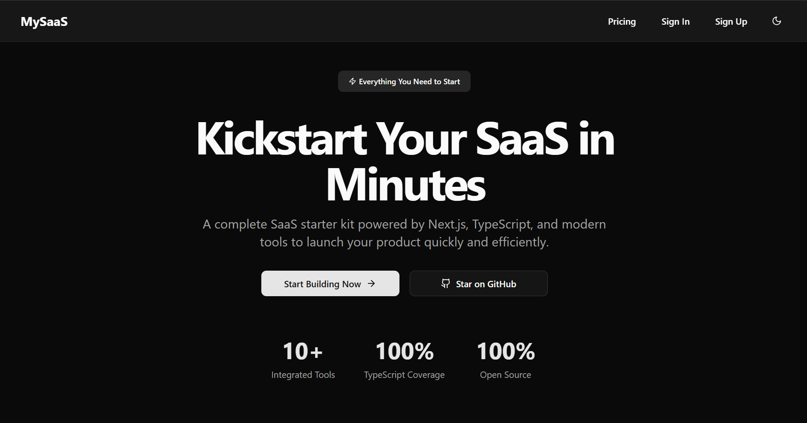

# 🚀 Next.js SaaS Starter

A production-grade, full-stack SaaS starter kit built with **Next.js**, **TypeScript**, and a thoughtfully curated modern tech stack. Launch your product faster with secure authentication, scalable database integration, AI integration, subscription billing, and a sleek UI — all out of the box.



## 🌐 Live Demo

Want to see it in action?  
👉 [Visit the live demo](https://nextjs-mysaas.vercel.app/)

## 📋 Overview

This starter kit provides a solid foundation for building SaaS applications. It includes everything from user authentication to billing, all set up with best practices so you can focus on your product instead of boilerplate.

## ✨ Features

- 🔒 Secure authentication with Clerk
- 📊 Database management with Neon and Drizzle ORM
- 📧 Email integration using Resend
- ⚡ Real-time webhooks setup
- 📱 Responsive sidebar navigation
- 🤖 AI capabilities powered by Google Gemini
- 💳 Billing and subscriptions via Clerk
- 🎨 Beautiful UI components from ShadCN
- 🖥️ Ready-to-use landing page with sleek and modern UI
- 📝 TypeScript for type-safe development
- 🌙 Light/dark mode support (via ThemeProvider)

## 🛠️ Tech Stack

- Next.js
- TypeScript
- Neon
- Drizzle ORM
- Clerk (Auth & Billing)
- Resend (Email)
- Webhooks (Clerk)
- Google Gemini AI
- ShadCN UI

## 🧠 Configuration

This starter kit includes a preconfigured ESLint setup.
If you’d like to adjust the linting rules to match your team’s preferences or coding style, you can easily do so by modifying the configuration in `eslint.config.mjs`.

## ⚙️ Getting Started

Follow the steps below to get your development environment running:

1. **Clone the repository**

    ```bash
    git clone https://github.com/aarushkx/nextjs-saas-starter.git
    cd nextjs-saas-starter
    ```

2. **Install dependencies**
   Install dependencies

    ```bash
    npm install
    ```

3. Configure environment variables

    Rename the `.env.sample` file to `.env.local` and replace with your own API keys and credentials.

4. Run migrations

    ```bash
    npm run db:migrate
    ```

5. Start the development server

    ```bash
    npm run dev
    ```

    Visit http://localhost:3000 to see it in action.

6. Build for production

    ```bash
    npm run build
    npm run start
    ```

## 🤝 Contributing

Contributions are welcome! Please follow these steps:

1. Fork the repository
2. Create a feature branch (`git checkout -b feature/AmazingFeature`)
3. Commit your changes (`git commit -m "Add some AmazingFeature"`)
4. Push to the branch (`git push origin feature/AmazingFeature`)
5. Open a Pull Request

## 📄 License

This project is licensed under the MIT License - see the [LICENSE](LICENSE) file for details.

## 🙋 Questions?

If you have any questions or need help, just open an issue on GitHub or reach out directly.

Happy building! 🎉
